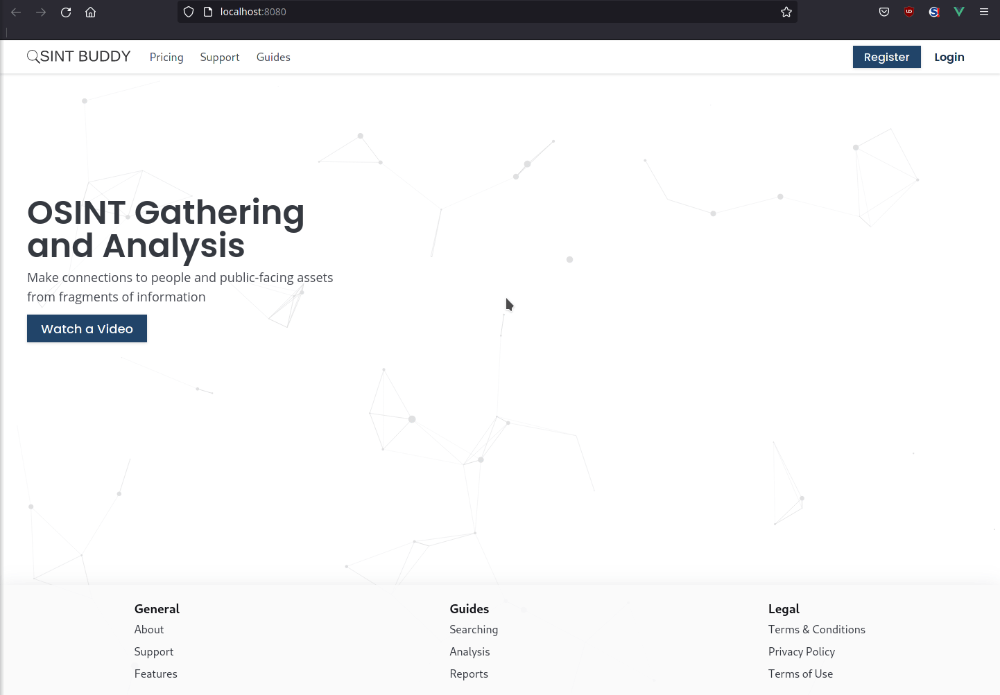
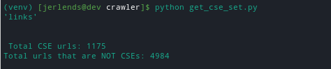
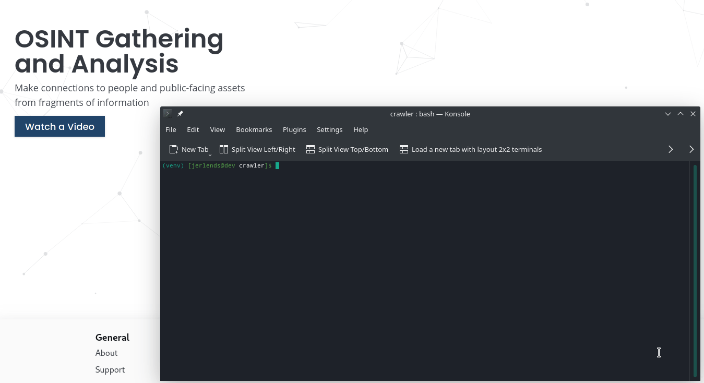
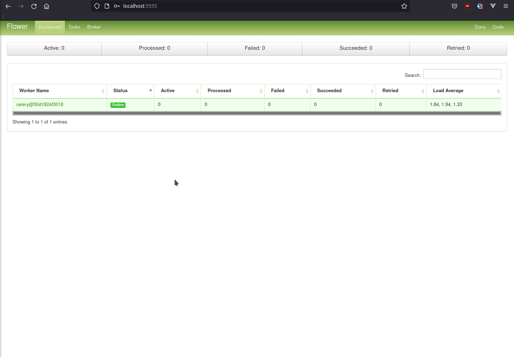
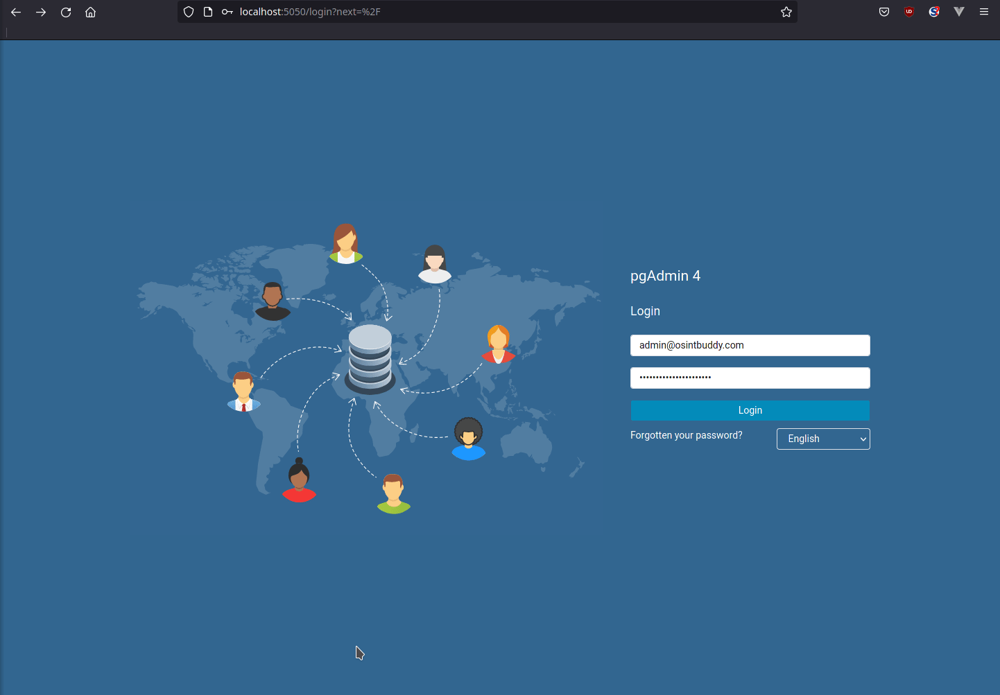

# osintbuddy-app


* Start the stack with Docker Compose:

```bash
docker-compose up -d
```


## urls

 - Frontend: http://localhost
 - Backend: http://localhost/api/
 - Documentation: http://localhost/docs
 - Documentation: http://localhost/redoc
 - PGAdmin: http://localhost:5050
 - Flower: http://localhost:5555
 - Traefik UI: http://localhost:8090

**Note**: The first time you start your stack, it might take a minute for it to be ready. While the backend waits for the database to be ready and configures everything. You can check the logs to monitor it.


#### Account Pages




#### Total CSE URLs




#### CSE Crawler Demo




#### Docs overview


#### Flower




#### PGAdmin




#### Traefik


