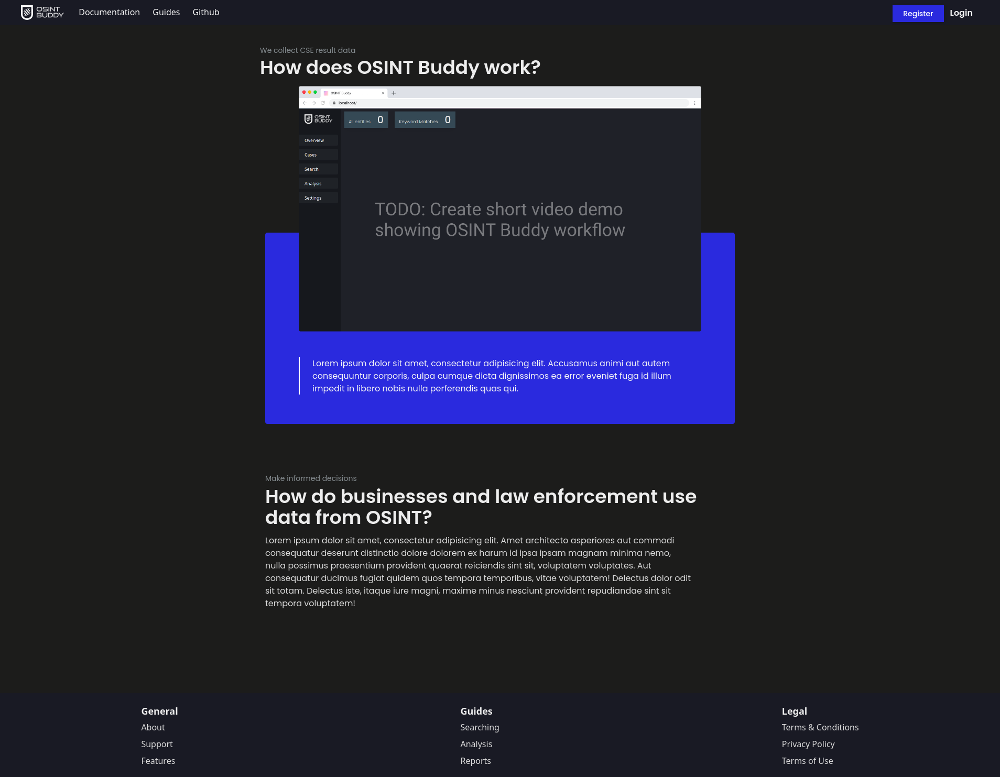
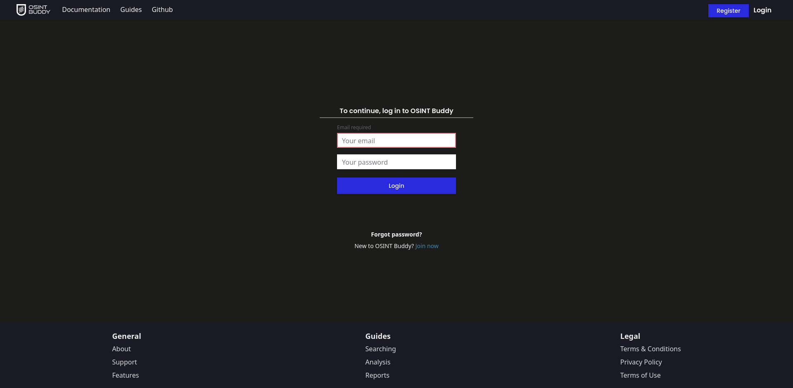
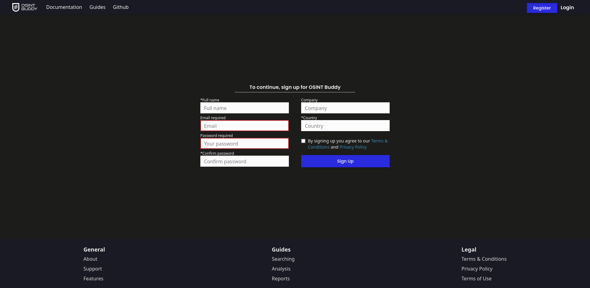
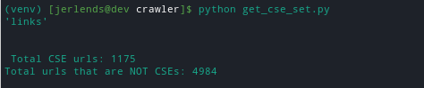
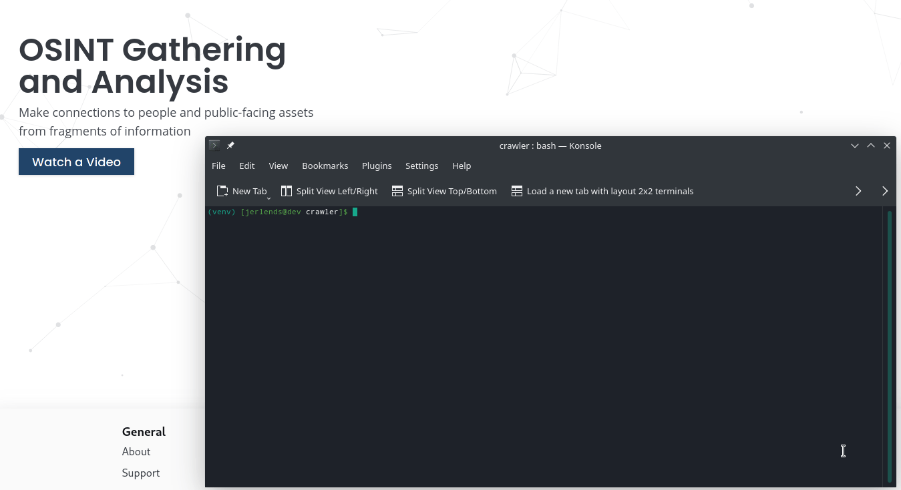

[![Contributors][contributors-shield]][contributors-url]
[![Forks][forks-shield]][forks-url]
[![Stargazers][stars-shield]][stars-url]
[![Issues][issues-shield]][issues-url]

<br />

<p align="center">
  <a href="https://github.com/jerlendds/osintbuddy">
    
  </a>


  <h3 align="center">OSINT Buddy</h3>

  <p align="center">
    osintbuddy is a work-in-progress OSINT tool for Google CSEs (Custom Search Engines).
What CSEs are is a targeted search engine for a specific site(s) URL. You can create your own CSEs and these CSEs will return any results that google finds for the given URLs. So far I've collected 1175+ CSE URLs from sources on the internet targeting different platforms and Im slowly working on creating an open-source project that you can deploy as a webapp for OSINT purposes. The crawler directly queries Googles CSE API which is super fast
    <br />  </p></p>


<!-- TABLE OF CONTENTS -->

<details open="open">
  <summary><h2 style="display: inline-block">Table of Contents</h2></summary>
  <ol>
    <li>
      <a href="#about-the-project">About The Project</a>
    </li>
    <li>
      <a href="#getting-started">Getting Started</a>
      <ul>
        <li><a href="#installation">Installation</a></li>
      </ul>
    </li>
    <li><a href="#usage">Usage</a></li>
    <li><a href="#roadmap">Roadmap</a></li>
    <li><a href="#contributing">Contributing</a></li>
    <li><a href="#contact">Contact</a></li>
  </ol>
</details>


<!-- ABOUT THE PROJECT -->
## About The Project

*this project is a work-in-progress however feel free to extract out the crawler directory that's for the Google CSE scraper, it's very fast :)*

Query the Google CSE API, store results, analyse, and more all through a deployable webapp.


## Features

- Directly query the Google CSE API through a two step request process that may return up to 100 results per API request. (Scrapy)
- Web interface for visualizing and navigating through results (work-in-progress, Vue)
- FastAPI app using a PostgreSQL Database with the SQLAlchemy ORM making additional analysis features a breeze to create
- 1175+ CSE links targeting a variety of platforms and more being added weekly
- plus more in development...


<!-- GETTING STARTED -->

## Getting Started

This section is a stub. Updates to this section will come once this project reaches a later stage...


To get a local copy up and running follow these simple steps.

### Installation

1. Clone the repo
   ```sh
   git clone https://github.com/jerlendds/osintbuddy.git
   ```
   
2. Install Docker Compose

3. Start the stack with Docker Compose:

   ```sh
   docker-compose up -d
   ```

 - **URLs**
    - Frontend: http://localhost
    - Backend: http://localhost/api/
    - Documentation: http://localhost/docs -- http://localhost/redoc
    - PGAdmin: http://localhost:5050
    - Flower: http://localhost:5555
    - Traefik UI: http://localhost:8090


<!-- ROADMAP -->

## Roadmap

See the [open issues](https://github.com/jerlendds/osintbuddy/issues) for a list of proposed features (and known issues).


## Progress Notes

- [Oct 5, 2021]
  
  - UI Updates
  
- [Sept 28, 2021]
  
  - Fixed bug in parsing the 'cse.js' response and massively increased crawler success rate (HTTP 200) when scraping CSE urls
  - Implemented proxy support that will rotate through a list of proxies
  - Added support for a brightdata.com proxy list
  - Added infinite scrolling to CSE results on the frontend
  - Started adding endpoints for querying search results
  
- [Sept 21, 2021]
  
  - Dockerized the Scrapy crawler and added to stack, made plans to add CSE link updating at regular intervals
  
  
  
  ### Progress Screenshots
  
  
  
  
  
  
  
  
  
  
  
  Added infinite scrolling to results. Frontend POSTs to backend, backend POSTs to crawler which spawns a Scrapy Spider on the crawler server for saving CSE results to the database
  
  
  
  
  #### Total CSE URLs




#### 		CSE Crawler Demo	


<!-- CONTRIBUTING -->
## Contributing

Contributions are what make the open source community such an amazing place to learn, inspire, and create. Any contributions you make are **greatly appreciated**.

1. Fork the Project
2. Create your Feature Branch (`git checkout -b feature/AmazingFeature`)
3. Commit your Changes (`git commit -m 'Add some AmazingFeature'`)
4. Push to the Branch (`git push origin feature/AmazingFeature`)
5. Open a Pull Request


<!-- CONTACT -->
## Contact

jerlendds - jerlends@tuta.io

Project Link: [https://github.com/jerlendds/osintbuddy](https://github.com/jerlendds/osintbuddy)


<!-- MARKDOWN LINKS & IMAGES -->
<!-- https://www.markdownguide.org/basic-syntax/#reference-style-links -->
[contributors-shield]: https://img.shields.io/github/contributors/jerlendds/osintbuddy.svg?style=for-the-badge
[contributors-url]: https://github.com/jerlendds/osintbuddy/graphs/contributors
[forks-shield]: https://img.shields.io/github/forks/jerlendds/osintbuddy.svg?style=for-the-badge
[forks-url]: https://github.com/jerlendds/osintbuddy/network/members
[stars-shield]: https://img.shields.io/github/stars/jerlendds/osintbuddy.svg?style=for-the-badge
[stars-url]: https://github.com/jerlendds/osintbuddy/stargazers
[issues-shield]: https://img.shields.io/github/issues/jerlendds/osintbuddy.svg?style=for-the-badge
[issues-url]: https://github.com/jerlendds/osintbuddy/issues


