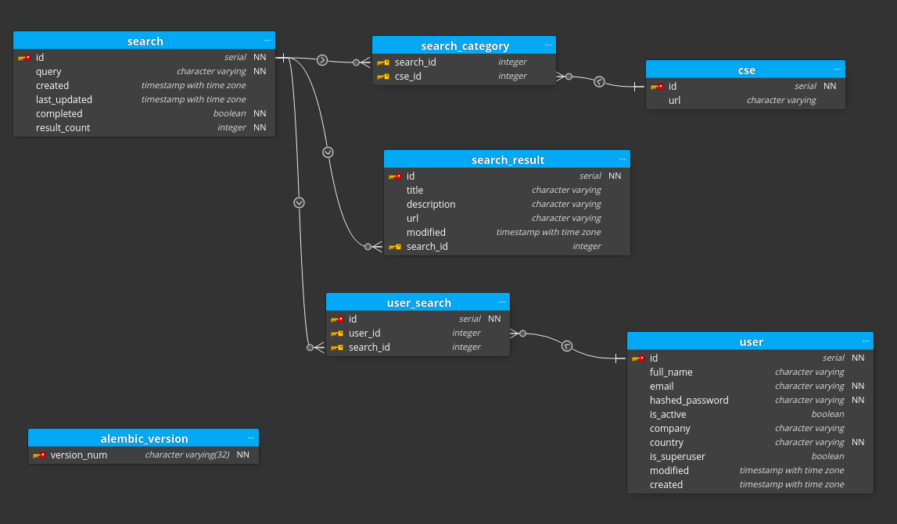

---

## Overview

*this project is a work-in-progress however feel free to extract out the crawler directory that's for the Google CSE scraper, it's very fast :)*

Google provides something called Custom Search Engines (CSEs) and what CSEs are is a targeted search engine for a specific site(s) URL. You can create your own CSEs and these CSEs will return any results that google finds for the given URLs.

osintbuddy is an OSINT tool for Google CSEs. Directly query the Google CSE API, store results, analyse, and more all through a deployable and scaleable webapp.


## Features

- Directly query the Google CSE API through a two step request process that may return up to 100 results per API request. (Scrapy)
- Web interface for visualizing and navigating through results (work-in-progress, Vue)
- FastAPI app using a PostgreSQL Database with the SQLAlchemy ORM making additional analysis features a breeze to create
- 1150+ CSE links targeting a variety of platforms and more being added weekly
- plus more features in development...


## Running OSINT Buddy

This section is a stub. Updates to this section will come once this project reaches a later stage...


* Start the stack with Docker Compose:

```bash
docker-compose up -d
```


## URLs

 - Frontend: http://localhost
 - Backend: http://localhost/api/
 - Documentation: http://localhost/docs -- http://localhost/redoc
 - PGAdmin: http://localhost:5050
 - Flower: http://localhost:5555
 - Traefik UI: http://localhost:8090

**Note**: The first time you start your stack, it might take a minute for it to be ready. While the backend waits for the database to be ready and configures everything. You can check the logs to monitor it.


## Progress Notes

- [Sept 21, 2021]
  - Dockerized the Scrapy crawler and added to stack, made plans to add CSE link updating at regular intervals
- [Sept 28, 2021]
  - Fixed bug in parsing the 'cse.js' response and massively increased crawler success rate (HTTP 200) when scraping CSE urls
  -  Implemented proxy support that will rotate through a list of proxies
  - Added support for a brightdata.com proxy list
  - Added infinite scrolling to CSE results on the frontend
  - Started adding endpoints for querying search results

### Progress Screenshots

Added infinite scrolling to results


#### Crawler Demo

Frontend POSTs to backend, backend POSTs to crawler which spawns a Scrapy Spider for saving CSE results to the database (Much faster than pictured below, this gif is from before a bug was fixed)


#### Mobile Results


#### Old Database Implementation





#### Account Pages


#### Total CSE URLs


#### CSE Crawler Demo


